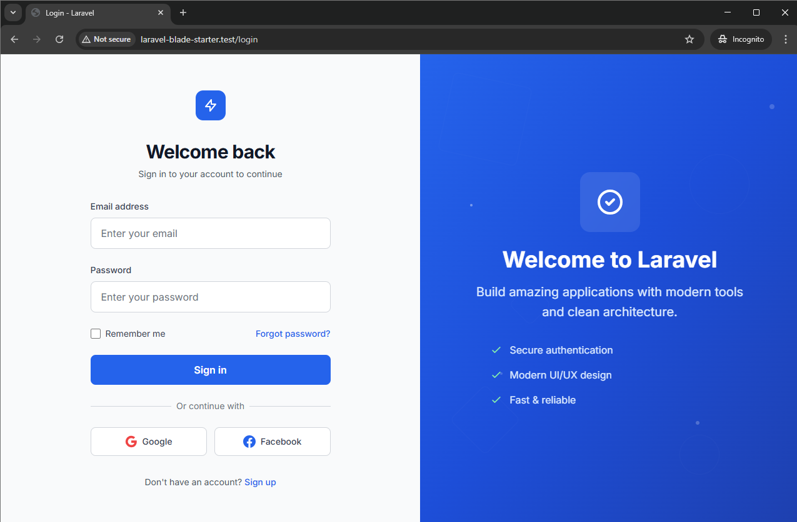
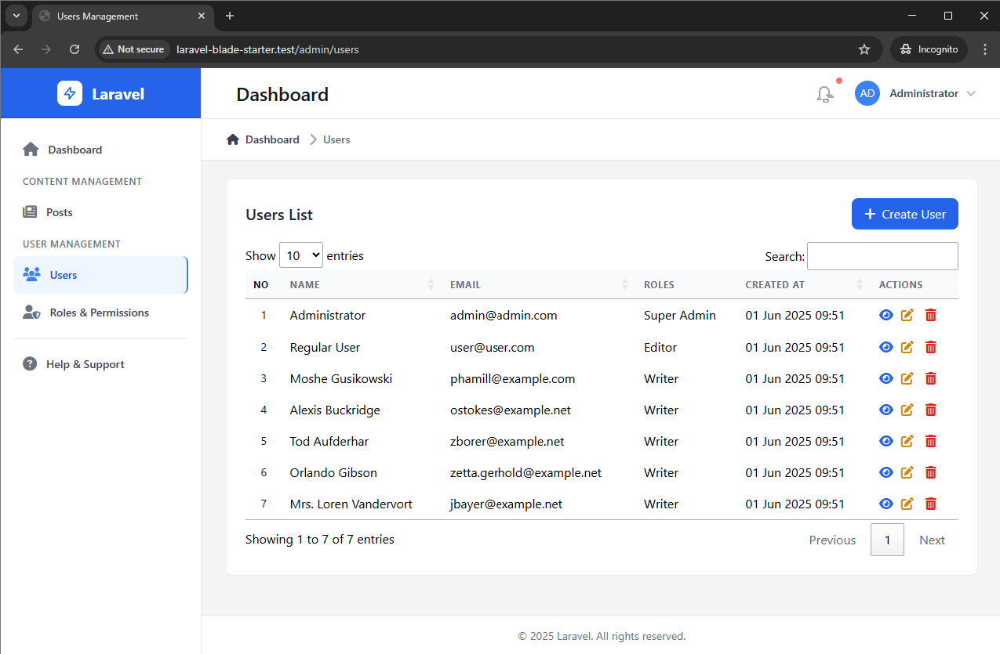

# Laravel Blade Starter

A modern Laravel starter template with authentication using Blade templating engine. Features a clean, responsive UI with Tailwind CSS.

## Screenshot


*Modern and responsive login interface with dark mode support*


*Clean and intuitive dashboard layout with key metrics and navigation*

## Features

- 🔐 User Authentication (Login)
- 👥 Role-Based Access Control (RBAC)
- 🛡️ Granular Permissions System
- 🔒 Permission-Based Authorization
- 🎨 Modern UI with Tailwind CSS
- 📱 Fully Responsive Design
- 🔄 AJAX Form Submissions
- 🚀 jQuery Integration
- 👁️ Password Toggle Visibility
- ⚡ Smooth Animations and Transitions
- 🗂️ Role & Permission Management
- 🔍 Permission Caching

## Requirements

- PHP >= 8.2
- Required PHP Extensions:
  ```bash
  # For Ubuntu/Debian systems
  sudo apt update
  sudo apt install -y \
    php8.2 \
    php8.2-fpm \
    php8.2-cli \
    php8.2-common \
    php8.2-mysql \
    php8.2-pgsql \
    php8.2-mbstring \
    php8.2-xml \
    php8.2-curl \
    php8.2-zip \
    php8.2-bcmath \
    php8.2-intl \
    php8.2-gd
  ```
- Composer 2.x
- Node.js >= 16.x & NPM >= 8.x
- MySQL >= 8.0 or PostgreSQL >= 13

## Installation

1. Clone the repository
```bash
git clone https://github.com/yourusername/laravel-blade-starter.git
cd laravel-blade-starter
```

2. Install PHP dependencies
```bash
composer install
```

3. Install NPM dependencies
```bash
npm install
```

4. Create and configure .env file
```bash
cp .env.example .env
php artisan key:generate
```

5. Configure your database in .env file
```env
DB_CONNECTION=mysql
DB_HOST=127.0.0.1
DB_PORT=3306
DB_DATABASE=your_database_name
DB_USERNAME=your_database_user
DB_PASSWORD=your_database_password
```

6. Set proper folder permissions (for Linux/Unix systems)
```bash
# Set proper ownership for storage and bootstrap/cache directories
sudo chown -R 33:33 storage bootstrap/cache
# Or if you're using different user:group
sudo chown -R www-data:www-data storage bootstrap/cache

# Set directory permissions
chmod -R 775 storage bootstrap/cache
```

7. Run database migrations
```bash
php artisan migrate
```

8. Build assets
```bash
npm run dev
```

9. Start the development server
```bash
php artisan serve
```

Visit `http://localhost:8000` in your browser.

## Development

For development with hot-reload:

```bash
# Terminal 1: Laravel Server
php artisan serve

# Terminal 2: Vite Development Server
npm run dev
```

## Production Deployment

For production deployment:

```bash
npm run build
php artisan optimize
php artisan config:cache
php artisan route:cache
php artisan view:cache
```

## Security

If you discover any security-related issues, please email your@email.com instead of using the issue tracker.

## License

The Laravel Blade Starter is open-sourced software licensed under the [MIT license](https://opensource.org/licenses/MIT).